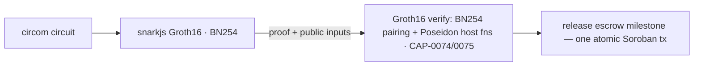
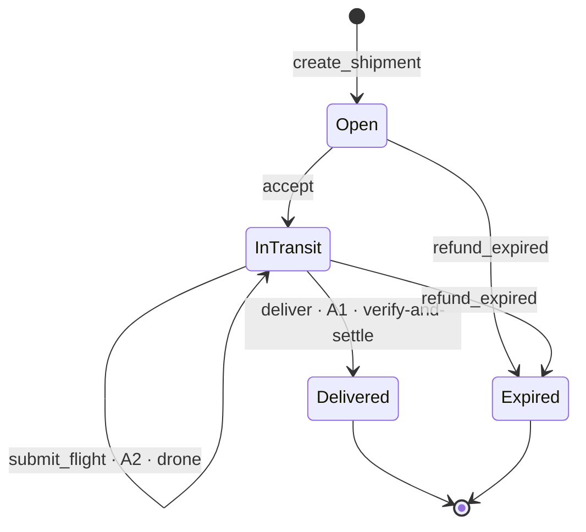
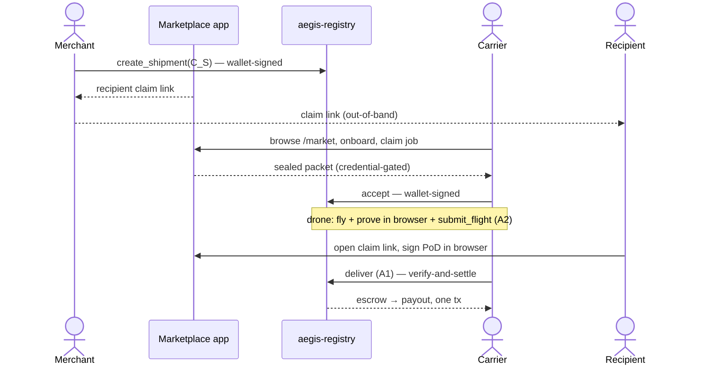

# Aegis Relay — Architecture

Privacy-preserving supply-chain custody & delivery settlement on Stellar. This
document is the single technical reference; the [`README`](README.md) carries the
pitch, the deployed-contract table, verifiable testnet runs, and the full
*Honest Limitations*.

---

## 1. What the system proves

On-chain there is only an **opaque shipment commitment `C_S`**, an **escrow**, a
**state machine**, and **Groth16 proofs**. Each verified proof atomically advances
the shipment and releases an escrow milestone **in the same Soroban transaction** —
no oracle, no off-chain settlement layer. Three ZK statements gate settlement, each
impossible to make without ZK (a hash- or signature-only design would either leak
the secret or prove nothing):

1. **Custody** — the holder is a credentialed carrier bound to the signed handoff
   chain, without publishing any identity.
2. **Compliance** (drone legs) — the flight stayed inside a regulator-approved
   corridor and respected altitude/speed/payload limits with no gaps, *without
   publishing the route*.
3. **Delivery** — the committed recipient confirmed receipt at the committed
   destination region, *without revealing who or where they are*.

---

## 2. The proving pipeline (platform-native, no external verifier)



The Groth16 verifier is **not** one host function — it is assembled in
`contracts/aegis-registry/src/groth16.rs` from Stellar's native BN254
pairing/group-op primitives plus the native Poseidon permutation (the CAP-0074 /
CAP-0075 host functions). Verifying a proof and releasing escrow happen in one tx.

**Two proving stacks coexist and never merge:**
- **Aegis's own circuits** — circom / Groth16 / **BN254** / Baby Jubjub / Poseidon
  (circomlib Poseidon + EdDSA-Poseidon).
- **The confidential escrow rail** — consumes OpenZeppelin's confidential token, a
  *different* stack (Noir / UltraHonk / **Grumpkin** / Poseidon2), used strictly as
  a black-box contract plus its `@ctd/sdk` client. Neither stack touches the other.

---

## 3. Contracts

The Aegis Soroban workspace (`soroban-sdk` 26.1.0, target `wasm32v1-none`):

- **`aegis-registry`** — the state machine + Groth16 verifier + confidential rail.
- **`aegis-credentials`** — issuer root store; exposes only `set_root(root, epoch)`
  gated by `issuer.require_auth()` (no per-leaf issuance entrypoint).
- **`aegis-airspace`** — corridor root store (lane 7 approved), read server-side by
  the registry.
- **`aegis-common`** — DOM tags + encodings, kept in **three-language parity**
  (Rust / circom / TS).
- **`poseidon-merkle`** — transplanted from the v1 donor, parity-pinned.

The confidential token lives in a **separate `contracts-ct/` workspace** (an
OpenZeppelin fork with `AegisEscrowHooks` that cage per-shipment escrow accounts) —
built with `stellar contract build` **only** (plain cargo fails on the transitively
enabled spec-shaking feature), never merged into the main workspace.

Deployed testnet contract IDs + verifiable tx hashes: see the README's
*What's deployed & proven on testnet* table.

### Shipment state machine (the registry)



Every transition asserts its legal predecessor state (invariant I4); the delivery nullifier is spent once at `deliver`.

---

## 4. Circuits

Two circuits are built and tested (`circuits/`, circom 2.2.3, built via
`circuits/build.mjs`):

- **A1 `delivery.circom`** — proof of delivery (all methods). Statement: *the
  recipient committed in `C_S` signed a fresh PoD message bound to the current
  custodian and to a location inside the committed destination region; the
  nullifier is correctly derived.* ~10–14k constraints.
- **A2 `flight.circom`** — drone route compliance over `N=16` waypoints: inside
  `corridor_root`, time-monotonic and gap-free, under altitude/speed caps, origin
  and destination correct, payload within limits. ~70k constraints.

A3 (credential), A4 (multi-hop custody), and A5 (cold-chain) are specified and are
roadmap. Shared gadgets: `geocell`, `merkle_fixed` (fixed-depth Poseidon Merkle
with `leaf != PAD`), `log_digest`, `safe_cmp`, `constants`.

### Load-bearing invariants (do not rediscover)

- Roots / `C_S` / `head` in public inputs come from **contract storage**, never tx
  args.
- Every Poseidon call carries a `DOM_*` tag; tags are never reused. `PAD =
  poseidon2(0,0)`; membership gadgets constrain `leaf != PAD`.
- Custody head is the nested arity-2 form
  `poseidon2(poseidon2(DOM_ACCEPT, shipment_id), carrier_pk_commit)` — identical in
  Rust, circom, and TS.
- PoD message `m = poseidon([DOM_PODMSG=5, shipment_id, carrier_pk_commit, cell_rd,
  ts])`; the contract requires `|now − ts| ≤ 600 s`.
- **G2 encoding** `BE32(x_c1)‖BE32(x_c0)‖BE32(y_c1)‖BE32(y_c0)` — imaginary limb
  FIRST, the inverse of snarkjs JSON order (the classic multi-hour footgun; solved
  in `prover/src/lib/bn254.ts`). G1: `BE32(x)‖BE32(y)`.
- Merkle: even index = left child; zero-leaf padding `poseidon2(0,0)`.
- `require_auth` before any state touch; TTL bump on every persistent write.

---

## 5. The confidential rail (headline feature)

An optional rail hides the escrow **amount** on-chain. Per-shipment escrow accounts
are "caged" by contract hooks: holding the key grants proof-generation capability
but **zero spending authority** — the token asks the registry's state machine
before any movement. Settlements land with **no amount** on the explorer; a
designated regulator key can still decrypt them (dual auditor ciphertexts per
transfer). *Private to the world, transparent to the regulator.* Transparent rail:
verify-and-settle in one tx. Confidential rail: verify-then-settle in two atomic txs
(`deliver` then hook-admitted `confidential_transfer`), single-milestone only.

---

## 6. The marketplace web app (`dashboard/`)

A Next.js multi-sided marketplace that makes the protocol drivable end-to-end:

- **Merchants** create a shipment (transparent/confidential rail) and get a
  shareable **recipient claim link** (`/claim/<id>#<seed>` — the seed is in the URL
  fragment, never sent to the server).
- **Carriers** browse an **open-shipments board** (`/market`); once **credentialed**
  they claim a job, receive the sealed packet, verify it against on-chain `C_S`, and
  accept. First valid `accept` wins.
- **Recipients** open the claim link and sign the proof-of-delivery **in the
  browser** (EdDSA-Poseidon via circomlibjs); the server never holds the claim key.
- Carrier **reputation**, self-serve **onboarding**, poll **notifications**, and a
  **refund-on-expiry** dispute path complete the loop.



**Browser-side Groth16 proving.** The A1 delivery and A2 flight proofs are generated
client-side with snarkjs against static wasm/zkey artifacts served from
`dashboard/public/circuits/` — the *same* witness the server would assemble, proved
on the user's machine, flowing through the *unchanged* proof→scVal tx-encoding, so
the on-chain verify path is preserved and the app is fully static-hostable.

**Shared state** lives in a KV store (`dashboard/lib/server/kv.ts`): `@vercel/kv`
when configured, an in-memory fallback for local dev. The marketplace's off-chain
conveniences (self-serve credentialing, the KV store, unauthenticated demo APIs) are
a **demo UX layer, not the trust boundary** — the ZK proofs + contracts are. See the
README's *Honest Limitations* #10.

---

## 7. Repository layout

```
aegis-relay/
├── circuits/          # circom 2.2.3 + snarkjs — Aegis Groth16/BN254 stack
├── contracts/         # Aegis Soroban workspace (soroban-sdk 26.1.0, wasm32v1-none)
│   ├── poseidon-merkle/  aegis-common/  aegis-registry/  aegis-credentials/  aegis-airspace/
├── contracts-ct/      # SEPARATE workspace — OZ confidential-token fork  [stellar contract build]
├── prover/            # TypeScript CLIs + shared encoders (bn254, poseidon, packet, tree)
│   └── src/{merchant,carrier,dronesim,recipient,authority,confidential}.ts
├── dashboard/         # Next.js marketplace app — console, /market, /claim, browser proving
│   └── lib/server/    #   KV store, flows, prover-dist (vendored witness assembly)
└── vendor/ctd-sdk/    # vendored @ctd/sdk (MIT) — the confidential-rail client
```

The JS side is a **bun workspace** (root `package.json` + `bunfig.toml` hoisted
linker; members `vendor/ctd-sdk`, `dashboard`, `prover`); `@ctd/sdk` is
`workspace:*`. Use **node** (not bun) for snarkjs proving; **bun** for the
confidential rail.

---

## 8. Build & test

```bash
cargo test --workspace                         # Aegis contracts (52 tests)
cd contracts-ct && stellar contract build      # confidential-token workspace (6 hook tests)
node circuits/test/delivery.test.mjs           # A1: 13 checks (6 negatives)
node circuits/test/flight.test.mjs             # A2: 20 checks (9 negatives)
cd prover && npm install && npm test           # CLIs (32 tests)
bun install && cd dashboard && bun run build    # marketplace app (webpack build)
cd dashboard && bun test                        # dashboard unit tests (KV, listing, PoD parity, rep, …)
```

`cargo build --workspace --target wasm32v1-none --release` for the wasm.

---

## 9. Deployment (Vercel → aegis-relay.vercel.app)

The app is Vercel-deployable; the KV store is the one required piece of setup.

- **Root Directory = `dashboard`** (keep *Include files outside the Root Directory*
  ON — the build needs the repo-root bun workspace + vendored `@ctd/sdk`).
  `next.config.ts` sets `outputFileTracingRoot` to the repo root and the COOP/COEP
  headers for browser proving.
- **Env vars:**
  - **`KV_REST_API_URL` + `KV_REST_API_TOKEN` — REQUIRED.** Shipment/listing/claim/
    credential/reputation state lives in KV; without it `kv` falls back to a
    per-instance in-memory Map and state doesn't persist across serverless
    instances (the multi-actor loop breaks). Provision a **Vercel KV** or **Upstash
    Redis** (free tier) in the Storage tab and connect it — that sets both vars.
  - **`STELLAR_TESTNET_RPC_URL`** (or `AEGIS_RPC_URL`) — a reliable Soroban RPC.
- **One-time setup:** *Add New → Project* → import `dadadave80/aegis-relay` → Root
  Directory `dashboard` → Storage tab: create + connect a KV store → add
  `STELLAR_TESTNET_RPC_URL` → Deploy → rename the project to `aegis-relay`.
- The on-chain `deliver`/settle step needs a funded testnet **Freighter** wallet;
  the merchant and carrier must be **different wallets** (one on-chain role each).

The Groth16 zkeys ship as committed static assets in `dashboard/public/circuits/`
(~65 MB), so there is no serverless proving.
