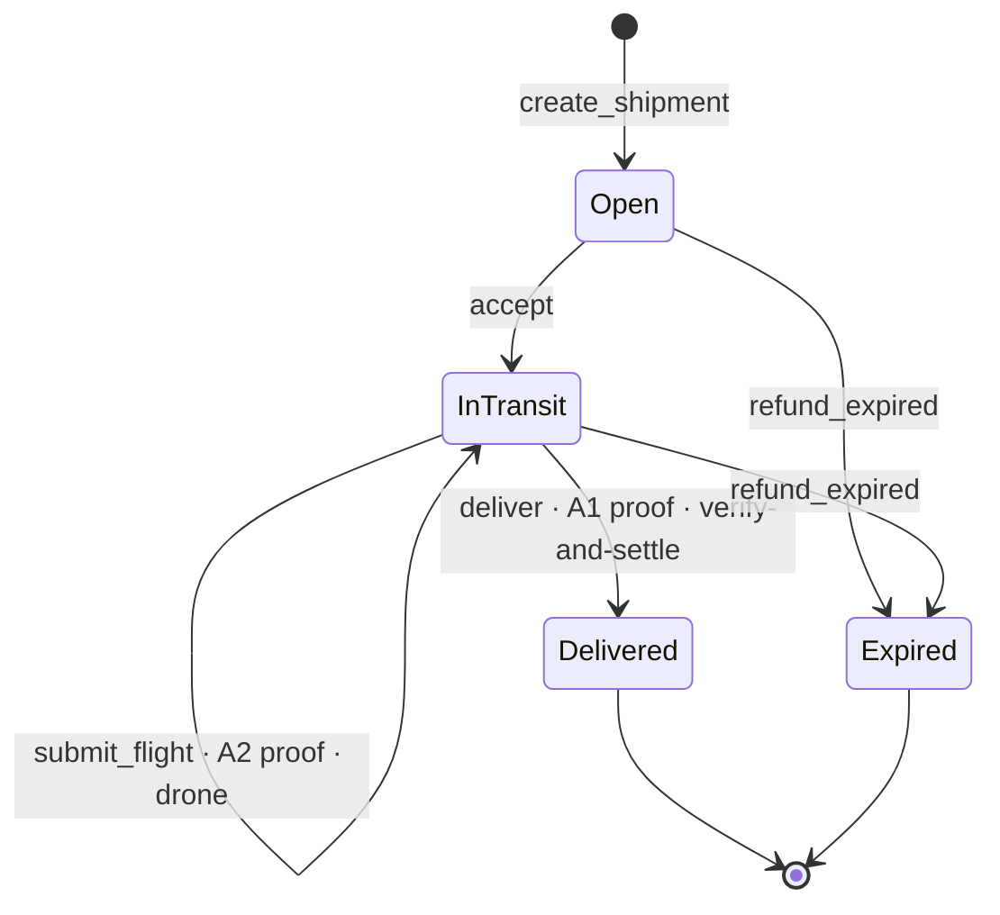
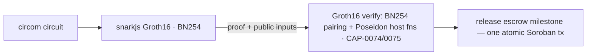

# Aegis Relay

**Privacy-preserving supply-chain custody & delivery settlement on Stellar — with drone delivery as a ZK-verified transport mode.**

[](https://github.com/dadadave80/aegis-relay/actions/workflows/ci.yml)

Global freight runs on data nobody wants to share: what is being shipped, what it is worth, who is receiving it, where they live, and which route it travels. Every one of those disclosures is an attack surface — theft targets manifests, competitors mine shipping graphs, and a published drone corridor is an interception map.

Aegis Relay lets merchants, carriers, and recipients settle deliveries on Stellar while the chain learns none of it. On-chain there is only an opaque shipment commitment, an escrow, a state machine, and Groth16 proofs. Each verified proof atomically advances the shipment and releases an escrow milestone **in the same Soroban transaction** — no oracle, no off-chain settlement layer. **Aegis v1 proved solvency without revealing balances; Aegis Relay proves *movement* without revealing the map.**

> Provenance: Relay is a fresh project bootstrapped by transplanting the proven BN254/Poseidon primitives from the v1 donor repo, [`dadadave80/aegis-zk-proof-of-reserves`](https://github.com/dadadave80/aegis-zk-proof-of-reserves) (read-only donor). Built for **Stellar Hacks: Real-World ZK** (DoraHacks).

---

## Why ZK is load-bearing

Aegis proves three statements about a shipment. Each one is *impossible* to make without ZK — a hash-only or signature-only design would either leak the secret or prove nothing:

1. **Custody** — the party holding the parcel is a credentialed carrier bound to the recorded chain of signed handoffs. *Without ZK: you must publish carrier identities.*
2. **Compliance** (drone legs) — the flight stayed inside a regulator-approved corridor and respected altitude, speed, and payload limits, with no gaps. *Without ZK: you must publish the flight path — the exact thing that makes drone corridors an interception map.*
3. **Delivery** — the committed recipient cryptographically confirmed receipt at the committed destination region. *Without ZK: you must publish who the recipient is and where they live.*

The marquee demonstration: **a machine proves it obeyed the rules of the sky without telling anyone where it flew.** ZK is the mechanism, not a garnish.

### The shipment lifecycle



Every transition asserts the expected current state; a Groth16 proof gates the milestone-releasing ones (`submit_flight`, `deliver`).

---

## What's deployed & proven on testnet

Everything below ran **live on Stellar Testnet** (Protocol 27) against the final deployment. Contracts and transactions are explorer-verifiable.

### Deployed contracts

| Contract | ID (Stellar Testnet) |
|---|---|
| `aegis-registry` (Groth16 verify + state machine + confidential rail) | [`CC4HXXHUE6ZCIVVN4XAHPV4JMYHEWK7ZIKILQMG5WCJ4V67NWLFTVGCA`](https://stellar.expert/explorer/testnet/contract/CC4HXXHUE6ZCIVVN4XAHPV4JMYHEWK7ZIKILQMG5WCJ4V67NWLFTVGCA) |
| `aegis-credentials` (issuer root store) | [`CBEDJCSBU3IKHW34HAZPL55CFJ5AZOTBJUGFXR5TS5JMRJN7W37K4FQF`](https://stellar.expert/explorer/testnet/contract/CBEDJCSBU3IKHW34HAZPL55CFJ5AZOTBJUGFXR5TS5JMRJN7W37K4FQF) |
| `aegis-airspace` (corridor root store, lane 7 approved) | [`CCOEGSF3BSLXYKZMMX2OCSOJONAGORRWSI33TIUX3EHPVVHNMVHNENOY`](https://stellar.expert/explorer/testnet/contract/CCOEGSF3BSLXYKZMMX2OCSOJONAGORRWSI33TIUX3EHPVVHNMVHNENOY) |
| `aegis-ct-token` (hooked OZ confidential-token fork) | [`CAIRUFAAIRRPIEKR7Q56JSI5B6PX3GMISCRHHQNAWFCFHIOD7W3XYHDC`](https://stellar.expert/explorer/testnet/contract/CAIRUFAAIRRPIEKR7Q56JSI5B6PX3GMISCRHHQNAWFCFHIOD7W3XYHDC) |
| CT verifier (UltraHonk VKs) | [`CBSD5PB2C2M43JPLSP5OGMQUXCCKQ3BI2JOOKAMVGOFMWZ3WMLYR2J26`](https://stellar.expert/explorer/testnet/contract/CBSD5PB2C2M43JPLSP5OGMQUXCCKQ3BI2JOOKAMVGOFMWZ3WMLYR2J26) |
| CT auditor (regulator key id 0) | [`CCORKIVLRHR3AIZB47VNVAHHIMNJ6QPEMDQYJQLJWOTSTXGJSO53GPP4`](https://stellar.expert/explorer/testnet/contract/CCORKIVLRHR3AIZB47VNVAHHIMNJ6QPEMDQYJQLJWOTSTXGJSO53GPP4) |

Full technical reference: [`ARCHITECTURE.md`](ARCHITECTURE.md).

### 1. Confidential courier — the amount is invisible, then the regulator opens it

A full COURIER lifecycle with **50 XLM escrowed and the amount hidden on-chain** (a Pedersen commitment on the hooked token; the registry stores `amount = 0` forever):

- Merchant funds a hook-caged escrow account, then `create_shipment` on the **Confidential** rail — no amount touches the registry.
- Carrier decrypts and verifies the hidden escrow balance against the on-chain commitment before accepting.
- **Premature settle rejected by the hook** — `Error(Contract, #4302)` (escrow keys grant zero spending authority; the token asks the registry's state machine first).
- **Withdraw-to-public-rail rejected** — `Error(Contract, #4301)` (escrow funds can never exit to the transparent rail).
- Real Groth16 A1 delivery proof verified on-chain — [`deliver` tx `e531caf6…`](https://stellar.expert/explorer/testnet/tx/e531caf6f59e417548830204e5985a445c0a50755fa4154caa673bc37fa77fcd).
- Hook-admitted confidential settle — [settle tx `2d990d64…`](https://stellar.expert/explorer/testnet/tx/2d990d64577a95af182aec1e1032a9f96c9cf965ad7714ac9cc8e737b93f9aa3). **The explorer shows this transfer with no amount.**
- The regulator's auditor key then decrypts the settlement: **500000000 units = 50 XLM.** *Private to the world, transparent to the regulator.*

Step-by-step log with every tx hash: [`prover/test-e2e/confidential-e2e.md`](prover/test-e2e/confidential-e2e.md).

### 2. Transparent drone — a corridor-compliant flight gates settlement

A full DRONE lifecycle on lane 7: `create` (25 XLM) → `accept` (custody head computed on-chain) → the drone flies 16 signed telemetry points, one Groth16 A2 proof (~3.7 s for the 70,565-constraint circuit) is verified on-chain against the corridor root **read from the airspace contract's own storage**, setting `flight_ok = true` → PoD → `deliver` → 25 XLM released. Route: never published.

### 3. Live on-chain attack rejections

Three real attacks, each rejected by a *different* layer of the on-chain verify path:

- **Replay** of an old flight proof → `Error(Contract, #4)` **TsBeforeAccept** (freshness layer fires before the proof is even checked).
- **Bit-flipped proof** (point off-curve) → `Error(Crypto, InvalidInput)` (host point-deserialization rejects).
- **Valid-points-wrong-proof** → `Error(Contract, #1)` **BadProof** (the BN254 pairing check itself fails).

Plus 8 witness-level drone attacks (stray, teleport, gap, non-monotonic, splice, heavy, altitude, foreign-key) that **cannot even produce a proof** — proven by [`prover/test-e2e/dronesim-attacks.test.mjs`](prover/test-e2e/dronesim-attacks.test.mjs). Run log: [`prover/test-e2e/live-testnet-runs.md`](prover/test-e2e/live-testnet-runs.md).

---

## The interactive marketplace (web app)

Beyond the CLIs, Aegis Relay ships a **multi-sided marketplace web app** (`dashboard/`) that turns the protocol into a live product a judge can drive end-to-end:

- **Merchants** create a shipment (transparent or confidential rail) and get a shareable **recipient claim link**.
- **Carriers** browse an **open-shipments board** (`/market`) and — once **credentialed** — claim a job, receive the sealed packet, verify it against on-chain `C_S`, and accept custody. First valid `accept` wins (the registry enforces it).
- **Recipients** open the claim link and sign the proof-of-delivery **in their own browser** (EdDSA-Poseidon via circomlibjs); the seed rides in the URL fragment and the server never holds the claim key.
- Carrier **reputation**, self-serve **onboarding**, live board **notifications** (poll), and a **refund-on-expiry** dispute path round out the loop.

**Groth16 proving runs in the browser.** The A1 delivery and A2 flight proofs are generated client-side with snarkjs against static wasm/zkey artifacts — the *same* witness the server would assemble, proved on the user's machine, flowing through the *unchanged* on-chain verify path — so the app is fully static-hostable (Vercel) with no serverless proving.

Live demo: **https://aegis-zk-relay.vercel.app** · local: `bun install && cd dashboard && bun run dev` (deployment in [`ARCHITECTURE.md`](ARCHITECTURE.md)).

---

## Architecture

The pipeline is fully platform-native — no external verifier service:



The Groth16 verifier is **not** a single host function. It is assembled in [`contracts/aegis-registry/src/groth16.rs`](contracts/aegis-registry/src/groth16.rs) from Stellar's native BN254 pairing/group-op primitives and the native Poseidon permutation (the CAP-0074 / CAP-0075 host functions). Verifying a proof and releasing escrow happen in the same transaction.

**Two proving stacks coexist and are never merged.** Aegis's own circuits are circom / Groth16 / **BN254** / Baby Jubjub / Poseidon (circomlib Poseidon + EdDSA-Poseidon). The confidential escrow rail consumes OpenZeppelin's confidential token, which brings a *different* stack — Noir / UltraHonk / **Grumpkin** / Poseidon2 — used strictly as a black-box contract plus its `@ctd/sdk` client. Neither touches the other.

**Contracts.** The Aegis Soroban workspace (`soroban-sdk` 26.1.0, `wasm32v1-none`): `aegis-registry` (state machine + verifier + confidential rail), `aegis-credentials` and `aegis-airspace` (thin `require_auth`-gated root stores read server-side by the registry), `aegis-common` (constants/encodings, kept in three-language parity), and `poseidon-merkle` (transplanted from v1, parity-pinned). The confidential token lives in a **separate** `contracts-ct/` workspace (an OpenZeppelin fork with `AegisEscrowHooks`) — built with `stellar contract build` only, never merged into the main workspace.

```
aegis-relay/
├── circuits/            # circom 2.2.3 + snarkjs — Aegis Groth16/BN254 stack
│   ├── lib/             #   geocell, merkle_fixed, log_digest, safe_cmp, constants
│   ├── delivery.circom  flight.circom
│   ├── build.mjs        #   compile + ceremony + zkey driver
│   └── test/            #   positive + negative suites (+ gadgets/)
├── contracts/           # Aegis Soroban workspace (soroban-sdk 26.1.0, wasm32v1-none)
│   ├── poseidon-merkle/       # transplanted from v1, parity-pinned
│   ├── aegis-common/          # DOM tags + encodings (3-language parity)
│   ├── aegis-registry/        # state machine + Groth16 verifier + confidential rail
│   ├── aegis-credentials/     # issuer root store
│   └── aegis-airspace/        # corridor root store
├── contracts-ct/        # SEPARATE workspace — OZ confidential-token fork
│   ├── token/           #   AegisEscrowHooks (hook-caged escrow)   [stellar contract build]
│   └── verifier/  auditor/
├── prover/              # TypeScript CLIs + shared encoders
│   └── src/{merchant,carrier,dronesim,recipient,authority,confidential}.ts
│       └── lib/         #   bn254 (G2 limb-swap Rosetta stone), poseidon, packet, tree
├── dashboard/           # Next.js marketplace app — console, /market board,
│                        #   /claim recipient page, browser-side Groth16 proving
└── ARCHITECTURE.md      # single technical reference (docs consolidated here)
```

Two circuits are built and tested: **A1 `delivery.circom`** (proof of delivery, all methods) and **A2 `flight.circom`** (drone route compliance, N=16 waypoints). Credential (A3), multi-hop custody (A4), and cold-chain (A5) circuits are specified in the design and are roadmap. Full protocol semantics and the technical reference live in [`ARCHITECTURE.md`](ARCHITECTURE.md).

---

## Quickstart

**Prerequisites.** Rust with the `wasm32v1-none` target and `stellar-cli` ≥ 27; **Node.js** (not bun) with **circom 2.2.3** on `PATH` for circuits and the prover; **bun** for the dashboard.

```bash
git clone https://github.com/dadadave80/aegis-relay
cd aegis-relay

# 1. Aegis Soroban contracts — 52 cargo tests
#    (Poseidon/Merkle parity, aegis-common 3-language parity, registry I1–I10 +
#     T-row + hook tests, credentials, airspace)
cargo test --workspace

# 2. Confidential-token workspace (separate; build with stellar-cli only —
#    plain cargo fails on the transitively-enabled spec-shaking feature).
#    Ships 6 hook tests.
cd contracts-ct && stellar contract build && cd ..

# 3. Circuits — needs circom 2.2.3 on PATH.  Each test compiles its circuit,
#    generates a witness, and runs positive + negative cases.
cd circuits && npm install && cd ..
node circuits/test/delivery.test.mjs      # A1: 13 checks (6 negatives)
node circuits/test/flight.test.mjs        # A2: 20 checks (9 negatives; ~minutes, 70k gates)
node circuits/test/parity.test.mjs        # cross-language Poseidon parity
#   gadget suite (61 assertions): circuits/test/gadgets/*.test.mjs

# 4. Prover / CLIs — 32 tests (bn254 encoding, packet, witness reconstruction, invoke snapshots)
cd prover && npm install && npm test && cd ..

# 5. Dashboard — track / map / verify
cd dashboard && bun install && bun run build && cd ..
```

CI runs the contracts, prover, and dashboard jobs on every push.

### Drive the live testnet deployment

Point the CLIs at the deployed registry and walk a full drone lifecycle. Values like the shipment id `N` and the carrier commitment are printed by earlier steps.

```bash
export AEGIS_REGISTRY_ID=CC4HXXHUE6ZCIVVN4XAHPV4JMYHEWK7ZIKILQMG5WCJ4V67NWLFTVGCA
export AEGIS_AIRSPACE_ID=CCOEGSF3BSLXYKZMMX2OCSOJONAGORRWSI33TIUX3EHPVVHNMVHNENOY
export AEGIS_NETWORK=testnet
cd prover

# 1. Merchant creates + funds a DRONE shipment (25 XLM against an opaque C_S).
#    Prints shipment id N and writes out/ships/N/packet.json
node --import tsx/esm src/merchant.ts create \
  --from-lat 6.4900 --from-lon 3.3500 --to-lat 6.5244 --to-lon 3.3792 \
  --amount 250000000 --deadline-hours 24 --method drone --lane 7

# 2. Carrier verifies the sealed packet against on-chain C_S, then accepts.
#    accept prints the carrier_pk_commit (a decimal) used by sign-pod below.
node --import tsx/esm src/carrier.ts verify-packet --packet out/ships/N/packet.json --id N
node --import tsx/esm src/carrier.ts accept --packet out/ships/N/packet.json \
  --payout $(stellar keys address relay-carrier)

# 3. Drone flies the lane, proves route compliance, submits on-chain (flight_ok = true).
node --import tsx/esm src/dronesim.ts fly    --id N --from 6.4900,3.3500 --to 6.5244,3.3792 --lane 7
node --import tsx/esm src/dronesim.ts prove  --id N
node --import tsx/esm src/dronesim.ts submit --id N

# 4. Recipient signs PoD; carrier proves delivery and settles atomically.
node --import tsx/esm src/recipient.ts sign-pod --id N --packet out/ships/N/packet.json \
  --carrier-commit <commit-printed-by-accept> --lat 6.5244 --lon 3.3792
node --import tsx/esm src/carrier.ts prove-delivery --id N --packet out/ships/N/packet.json \
  --pod out/ships/N/pod.json
node --import tsx/esm src/carrier.ts deliver --id N   # verify-and-settle: escrow → payout, one tx

# 5. The kicker — a strayed drone can't even produce a proof.
node --import tsx/esm src/dronesim.ts fly --id N --attack stray --from 6.4900,3.3500 --to 6.5244,3.3792 --lane 7
```

Running the confidential rail additionally requires the deployed CT contracts and the auditor key; the full driver is `prover/src/confidential.ts` (see [`prover/test-e2e/confidential-e2e.md`](prover/test-e2e/confidential-e2e.md)).

---

## Honest Limitations

Under-claiming is worse than the leak. This section is the point — a judge should trust the parts that work *because* the parts that don't are stated plainly. None of the following is a bug; each is a stated boundary with a roadmap.

**1. The drone proof trusts a key, not physics.** The proof means: *"a key credentialed as a drone class signed a telemetry log with these properties."* Nothing more. GPS spoofing, sensor tampering, or key extraction defeat it. Production mitigations — authenticated GNSS (e.g. Galileo OSNMA), secure-element key storage, cross-witness beacons, operator stake-and-slash — are **roadmap, none in this build**.

**2. The drone is a labeled software simulator, not hardware.** The demo drone secure element is a clearly-labeled software simulator (`prover/src/dronesim.ts`). The cryptography is identical to a real device; what changes in production is the *trust anchor* — who holds the signing key.

**3. Trusted setup is a dev ceremony.** Groth16 requires a per-circuit trusted setup. This build used a **development ceremony: single contributor, per circuit**. A toxic-waste holder could forge proofs. Published artifacts carry `snarkjs zkey verify` reproduction instructions; a regenerated verifying key verifies only on a contract redeployed with it. An **MPC ceremony is roadmap**.

**4. The confidential rail consumes an UNAUDITED preview.** The confidential escrow rail is built on OpenZeppelin's UltraHonk confidential-token (`stellar-contracts`, branch `feat/confidential-verifier-ultrahonk`, demo validated at rev `539968f`; hooked fork of `brozorec/stellar-confidential-token-demo` @ `8b34def`). It is explicitly **unaudited and not production ready**, per upstream. We reproduce that warning verbatim: do not use it to secure real value.

**5. The auditor master key sees all confidential amounts, by design.** Every confidential transfer emits dual auditor ciphertexts that the registered regulator key can decrypt. That is the compliance feature — and it means the regulator has full amount visibility. Deliberate, not a leak in the cryptographic sense.

**6. The verifier VK is mutable by a manager role in the demo.** On the confidential rail, `update_verification_key` is gated behind a `manager` role set to the deployer key for the demo. A compromised manager could swap the VK. **Immutable / multisig VKs are roadmap.** (Aegis's own registry VKs are immutable after `init`.)

**7. The confidential rail is single-milestone only, and deposits are public.** Because the registry never learns the amount, the confidential rail supports a single `[10000]` milestone only; multi-milestone escrow stays on the transparent rail. The merchant's `deposit` into the token is a **public amount** — the merchant's aggregate float across shipments, not a per-shipment figure.

**8. On-chain leaks that remain.** Even at best, the public chain still sees: settlement **addresses** (carrier accept + payout, merchant funding), state-transition **timing**, the `lane_id` (a coarse regulator-published route class), and — on the *transparent* rail — the **escrow amount**. Mitigated *now* by fresh Stellar keys per role per shipment (the demo does this) and a coarsened public deadline; batching / shielded-pool windows are roadmap.

**9. BN254 is ~100–110-bit security.** The choice is deliberate (smallest proofs, cheapest verify, native host-fn support, proven v1 plumbing). Migration to **BLS12-381 is roadmap**.

**10. The interactive marketplace is a demo UX layer, not a second trust boundary.** The web app makes the on-chain protocol drivable; its off-chain conveniences are deliberately open for testability and are **not** the security boundary — the ZK proofs and Soroban contracts are. In this build specifically: carrier **credentialing is self-serve** (any wallet can onboard — the `aegis-credentials` contract only exposes issuer-gated `set_root`, so real issuer-signed credential leaves are roadmap); shipment/claim state lives in a **KV store** (an in-memory fallback for local dev, a shared KV for a real deploy) rather than on-chain; and the demo APIs (claim-context, PoD-record, report) are **unauthenticated over enumerable shipment ids**, so the recipient signing-context endpoint can reveal a shipment's destination cell to anyone who knows its id. None of these weaken the on-chain guarantees; they are the demo's open surface, and closing them (seed-scoped claim tokens, issuer-signed credentials, wallet-bound claims) is roadmap.

---

## Roadmap

A4 multi-hop custody → A5 cold-chain telemetry → MPC trusted-setup ceremony → confidential-rail hardening (immutable/multisig verifier VKs, multi-milestone confidential escrow) → attempted-delivery griefing proofs → issuer/authority multisig + view-key selective disclosure for arbiters → BLS12-381 migration → real secure-element integration (OSNMA-authenticated GNSS) → upstreaming `poseidon-merkle` and the geocell/corridor toolkit as reusable Stellar ecosystem primitives.

---

## Credits & provenance

- **Aegis v1** — [`dadadave80/aegis-zk-proof-of-reserves`](https://github.com/dadadave80/aegis-zk-proof-of-reserves): the donor for the BN254/Poseidon substrate (the `poseidon-merkle` crate, the Groth16 verifier assembled from host primitives, and the snarkjs↔Soroban encoding "Rosetta stone" including the notorious G2 limb-swap). *"Aegis v1 proved solvency without revealing balances; Relay proves movement without revealing the map."*
- **OpenZeppelin Confidential Token** — `stellar-contracts` branch `feat/confidential-verifier-ultrahonk` (UltraHonk/Grumpkin, verified via Nethermind's `rs-soroban-ultrahonk`), consumed as a black-box contract + `@ctd/sdk`; demo integration based on `brozorec/stellar-confidential-token-demo`.
- **circomlib / circomlibjs** — Poseidon, EdDSA-Poseidon, and Merkle gadgets over Baby Jubjub.
- Design and implementation were AI-assisted (Claude Code).
